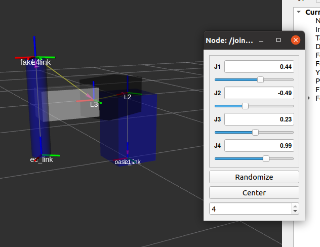
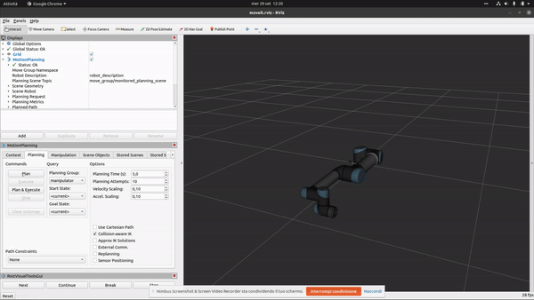

# RPC module B
Homeworks of RPC module B

Simone Cremasco VR468971

## Exercise B1
For this exercise you need to run 
```
roslaunch homework b1.launch
```
This will open rviz and load the scara urdf which is available in `urdf` folder.
<p align="center">
    
</p>
'fake_link' was needed in order to attach the end effector frame.
This also will bring up 2 services for direct and inverse kinematics.
In `srv` folder there is the type definition of services `directKinematics` and `inverseKinematics`.
The first receive as input the joint values (j1 to j4) and return a Pose message.
The second receive as input the operational space position as x, y, z, phi (rotation on z axis as it's the only possible rotation for a scara) and returns the joint values.
The scripts for those services are in `script` folder.

### Direct kinematics
To ask for direct kinematics run (change 0 0 0 0 with joint values you want)
```
rosservice call /directKinematics 0 0 0 0
```
The result will be
```
pose: 
  position: 
    x: 0.6
    y: 0.0
    z: -0.09999999999999998
  orientation: 
    x: 0.0
    y: 0.0
    z: 0.0
    w: 1.0
```

### Inverse kinematics
To ask for inverse kinematics run (change 0.6 0 -0.1 0 with x y z phi values you want)
```
rosservice call /inverseKinematics -- 0.6 0 -0.1 0
```
The result will be
```
j1: -0.0
j2: 0.0
j3: -0.0
j4: 0.0
```

## Exercise B2
For this exercise you need to run 
```
roslaunch homework b2.launch
```
This will activate bring up the necessary scripts for move it. Once loaded run
```
rosrun homework move
```
By pressing next when requested you can see the result, here's an animation.
<p align="center">
    
</p>

In order we have:

* move to a specific pose
* move to a specific joint state
* follow linear cartesian trajectory
* waypoint trajectory
* trajectory parallel to xy world plane
* box on workspace, trajectory will go over it
* cylinder to ee (not working properly)